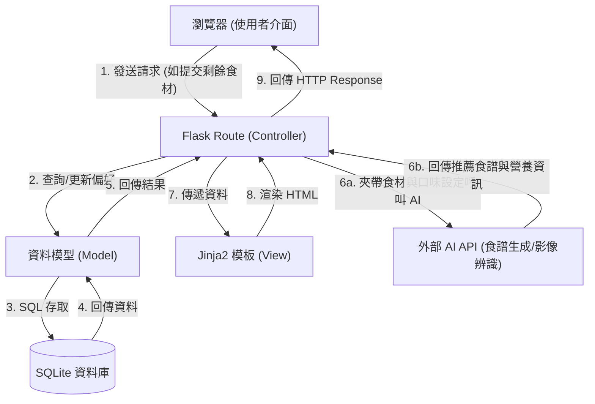

# 系統架構設計 (Architecture)

## 專案名稱
AI 智慧食譜推薦系統

---

## 1. 技術架構說明

### 選用技術與原因
本專案採用輕量級的後端框架與關聯式資料庫，確保開發速度與系統穩定性：
- **後端框架：Python + Flask**
  - **原因**：Flask 輕量、彈性高，適合快速開發 MVP（最小可行性產品）。Python 擁有豐富的 AI/ML 相關套件（如 OpenAI API 串接、影像處理），方便未來擴充「食材攝影辨識」等智慧功能。
- **模板引擎：Jinja2**
  - **原因**：搭配 Flask 原生支援，能直接在伺服器端將動態資料（如生成的食譜、營養分析數據）渲染至 HTML 頁面。無須建置複雜的前後端分離架構，大幅降低初期開發與維護成本。
- **資料庫：SQLite**
  - **原因**：不需要額外設定或維護獨立的資料庫伺服器，檔案式儲存便於本機開發、測試與小型部署，足以應付 MVP 階段的資料量與效能需求。

### Flask MVC 模式說明
系統採用類似 MVC (Model-View-Controller) 的設計模式來組織程式碼：
- **Model (資料模型)**：負責與 SQLite 資料庫互動，定義資料表結構（例如：使用者設定、已儲存的食譜、食材清單等），處理資料的存取與商業邏輯。
- **View (視圖)**：由 Jinja2 模板與前端 HTML/CSS/JS 組成，負責將資料呈現給使用者，並提供操作介面（如輸入食材的表單、拍照上傳按鈕）。
- **Controller (控制器)**：由 Flask 的 Routes (路由) 擔任，負責接收來自瀏覽器的 HTTP 請求，呼叫對應的 Model 存取資料，或呼叫外部 AI API 生成食譜，最後將整理好的資料交由 View 進行渲染。

---

## 2. 專案資料夾結構

以下為專案的建議資料夾與檔案結構，依照職責分離原則進行規劃：

```text
web_app_development/
├── app/                        # 應用程式主程式碼目錄
│   ├── models/                 # [Model] 資料庫模型定義與資料庫操作邏輯
│   │   ├── __init__.py
│   │   ├── user.py             # 使用者模型 (包含個人化口味設定)
│   │   ├── recipe.py           # 食譜模型 (包含營養分析與作法)
│   │   └── ingredient.py       # 食材模型 (冰箱剩餘食材與購物清單)
│   ├── routes/                 # [Controller] Flask 路由處理
│   │   ├── __init__.py
│   │   ├── main.py             # 首頁與一般靜態頁面路由
│   │   ├── auth.py             # 登入/註冊等身分驗證路由
│   │   ├── recipe.py           # 食譜生成、AI 串接、社群分享與收藏路由
│   │   └── inventory.py        # 冰箱食材與購物清單管理路由
│   ├── templates/              # [View] Jinja2 HTML 模板
│   │   ├── base.html           # 共同的網頁佈局 (Navbar, Footer 等)
│   │   ├── index.html          # 首頁 (輸入食材/拍照上傳介面)
│   │   ├── recipe_list.html    # 食譜推薦結果與社群分享列表
│   │   ├── recipe_detail.html  # 食譜詳細步驟與健康數據分析
│   │   └── profile.html        # 個人化口味與健康偏好設定
│   ├── static/                 # 靜態資源檔案
│   │   ├── css/                # 樣式表 (包含 RWD 響應式設定)
│   │   ├── js/                 # 前端互動邏輯 (如上傳圖片預覽)
│   │   └── images/             # 圖片資源
│   └── utils/                  # 共用工具與外部服務封裝
│       └── ai_service.py       # 封裝外部 AI API (如 OpenAI) 呼叫邏輯
├── instance/                   # 存放本機特定檔案 (不進版控)
│   └── database.db             # SQLite 資料庫檔案
├── docs/                       # 專案文件目錄
│   ├── PRD.md                  # 產品需求文件
│   └── ARCHITECTURE.md         # 系統架構設計 (本文件)
├── requirements.txt            # Python 套件依賴清單
├── .env                        # 環境變數設定 (如 API Key，不進版控)
└── app.py                      # 系統啟動入口 (初始化 Flask 與載入設定)
```

---

## 3. 元件關係圖

以下展示系統中各個元件的互動關係與資料流向：



---

## 4. 關鍵設計決策

1. **整合 AI 邏輯至獨立的 Utils 模組 (`ai_service.py`)**
   - **決策**：將呼叫外部 AI API 的程式碼從路由中抽離，獨立成專屬的服務模組。
   - **原因**：避免 Flask 路由的程式碼過於冗長複雜。同時提高彈性，若未來需要更換 AI 服務提供商（例如從 OpenAI 換成 Gemini），只需修改 `ai_service.py` 即可，不影響核心的控制器邏輯。

2. **採用 Server-Side Rendering (SSR) 搭配少量 JS**
   - **決策**：主要使用 Flask + Jinja2 進行伺服器端渲染，僅在需要即時互動（如照片預覽、動態增減食材表單）時使用少量的 Vanilla JS。
   - **原因**：符合 MVP 快速開發的原則，省去維護前端框架的學習與建置成本，同時能兼顧良好的網頁載入速度。

3. **漸進式功能實作：從手動輸入到影像辨識**
   - **決策**：在架構設計上，食譜生成的介面將同時支援「文字輸入/勾選」與「圖片上傳」，但初期開發先實作文字輸入流程，圖片上傳端點先做保留。
   - **原因**：因應 PRD 中將「食材攝影辨識」列為 Nice to Have 的優先級。這樣的架構保留了擴充性，同時確保核心的推薦功能可以第一時間上線驗證。
