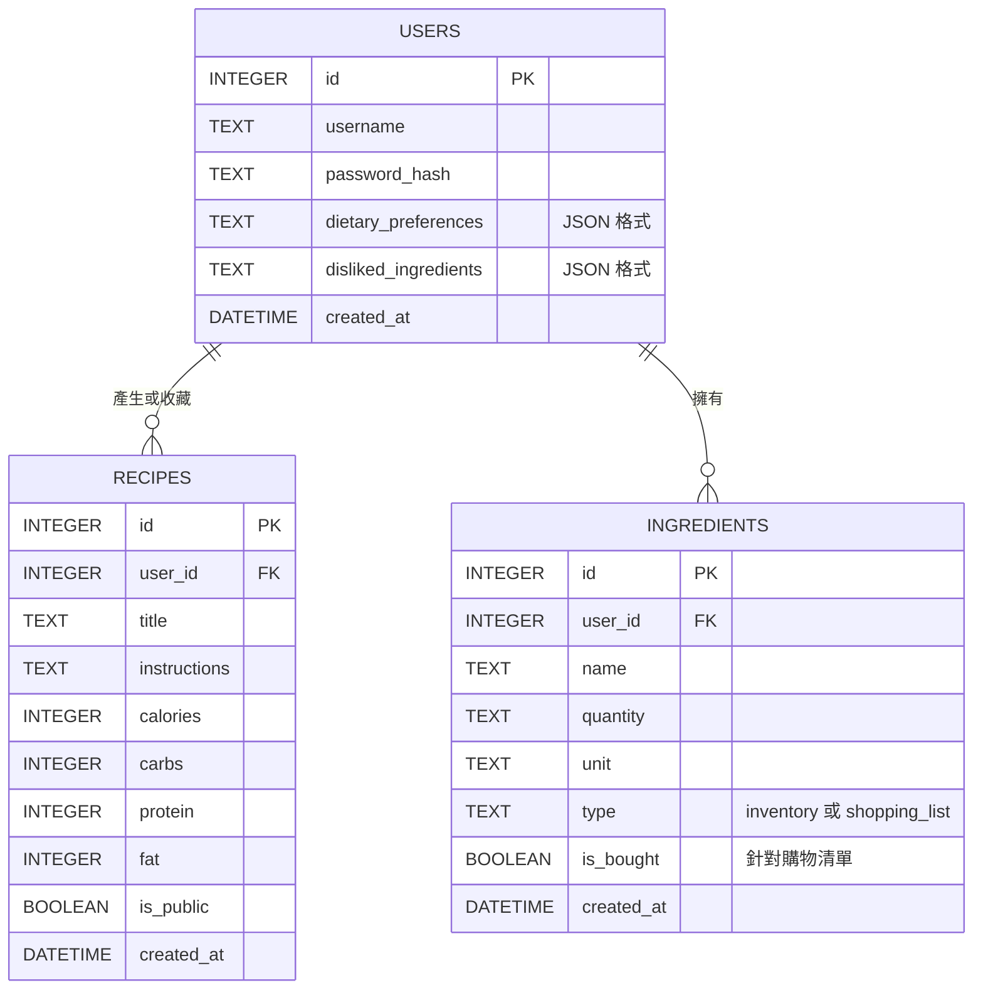

# 資料庫設計文件 (DB Design)

本文件描述「AI 智慧食譜推薦系統」的資料庫結構與欄位設計。由於採用 MVP 開發，我們使用 SQLite 作為本地資料庫，透過 Python `sqlite3` 存取。

## 1. ER 圖（實體關係圖）

## 2. 資料表詳細說明

### 2.1. users (使用者表)
儲存使用者的基本帳號資訊與個人化口味設定。
- `id`: INTEGER PRIMARY KEY AUTOINCREMENT。唯一識別碼。
- `username`: TEXT。使用者名稱。
- `password_hash`: TEXT。密碼雜湊值（保留欄位）。
- `dietary_preferences`: TEXT。使用者的飲食偏好（如「低碳水」、「生酮」），以字串或 JSON 儲存，方便直接組成 Prompt 傳給 AI。
- `disliked_ingredients`: TEXT。不吃的食材（如「香菜」、「牛肉」），同樣以字串或 JSON 儲存。
- `created_at`: DATETIME。帳號建立時間。

### 2.2. recipes (食譜表)
儲存 AI 生成的食譜與營養資訊。
- `id`: INTEGER PRIMARY KEY AUTOINCREMENT。
- `user_id`: INTEGER。Foreign Key，關聯至 `users(id)`。
- `title`: TEXT。食譜名稱。
- `instructions`: TEXT。食譜作法步驟。
- `calories`: INTEGER。熱量（大卡）。
- `carbs`: INTEGER。碳水化合物（克）。
- `protein`: INTEGER。蛋白質（克）。
- `fat`: INTEGER。脂肪（克）。
- `is_public`: BOOLEAN。是否發佈到社群公開牆（0=否, 1=是）。預設為 0。
- `created_at`: DATETIME。食譜建立時間。

### 2.3. ingredients (食材表)
結合「冰箱現有食材 (inventory)」與「我的購物清單 (shopping_list)」兩種情境，以 `type` 欄位進行區分。
- `id`: INTEGER PRIMARY KEY AUTOINCREMENT。
- `user_id`: INTEGER。Foreign Key，關聯至 `users(id)`。
- `name`: TEXT。食材名稱（如「蘋果」、「豬肉」）。
- `quantity`: TEXT。數量（如「2」、「半顆」）。為保留彈性使用 TEXT。
- `unit`: TEXT。單位（如「顆」、「克」）。
- `type`: TEXT。必填。值為 `inventory` 或 `shopping_list`。
- `is_bought`: BOOLEAN。僅當 `type` = `shopping_list` 時有意義，代表是否已採買（0=否, 1=是）。
- `created_at`: DATETIME。建立時間。
