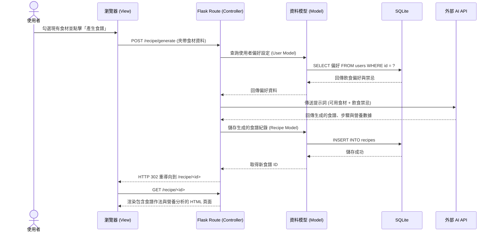

# 流程圖設計 (Flowchart)

本文件根據 PRD 與系統架構設計，繪製「AI 智慧食譜推薦系統」的使用者流程與系統序列圖。

---

## 1. 使用者流程圖 (User Flow)

描述使用者進入網站後的主要操作路徑，涵蓋偏好設定、輸入食材、查看推薦食譜及後續應用。

```mermaid
flowchart LR
    A([使用者進入網站]) --> B[首頁 - 剩餘食材輸入與勾選]
    
    A --> C[個人化設定]
    C --> C1[設定不吃的食材或飲食偏好]
    C1 --> B
    
    B --> D{要執行什麼操作？}
    
    D -->|送出食材| E[等待 AI 生成推薦食譜列表]
    E --> F{選擇其中一道食譜}
    F -->|查看詳情| G[食譜詳細頁面 (作法與營養分析)]
    
    G --> H{後續操作}
    H -->|一鍵轉換缺漏食材| I[我的購物清單]
    H -->|收藏/分享| J[社群食譜分享牆]
    
    D -->|直接逛逛| J
```

---

## 2. 系統序列圖 (Sequence Diagram)

此圖描述最核心的「使用者輸入食材並獲取 AI 食譜推薦」之完整資料流，包含如何讀取使用者偏好並與外部 AI 互動。



---

## 3. 功能清單對照表

根據上述流程，將系統主要功能、對應的 URL 路徑與 HTTP 方法整理如下（以 Server-Side Rendering 為主）：

| 功能名稱 | URL 路徑 | HTTP 方法 | 說明 |
| -------- | -------- | --------- | ---- |
| 首頁 / 輸入食材 | `/` | GET | 顯示首頁與食材輸入/圖片上傳表單 |
| 個人化口味設定頁面 | `/profile` | GET | 顯示使用者的飲食偏好與禁忌 |
| 更新個人化設定 | `/profile` | POST | 儲存使用者的偏好設定至資料庫 |
| 生成食譜推薦 | `/recipe/generate` | POST | 根據輸入的食材與偏好，呼叫 AI 生成食譜 |
| 食譜詳細資訊 | `/recipe/<id>` | GET | 顯示特定食譜的作法步驟與營養分析 |
| 收藏/分享食譜 | `/recipe/<id>/share` | POST | 將食譜狀態設為公開分享，或加入個人收藏 |
| 食譜列表與社群牆 | `/recipes` | GET | 列出使用者收藏的食譜或社群公開分享的食譜 |
| 我的購物清單 | `/inventory/shopping-list` | GET | 檢視系統自動整理或手動建立的待採買清單 |
| 更新購物清單 | `/inventory/shopping-list` | POST | 手動新增、修改項目，或標記為已採買 |
